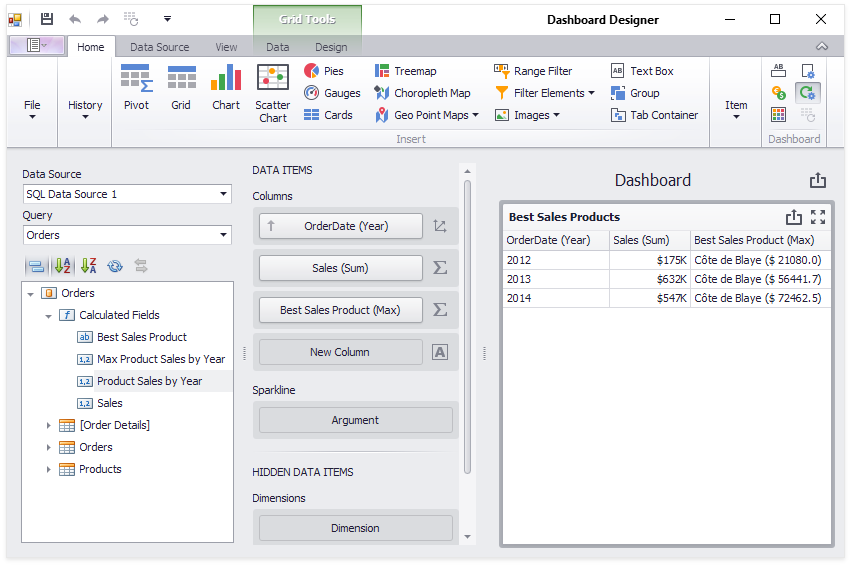

<!-- default file list -->
*Files to look at*:

* [Form1.cs](./CS/Dashboard_AggrBestSalesProducts/Form1.cs) (VB: [Form1.vb](./VB/Dashboard_AggrBestSalesProducts/Form1.vb))
<!-- default file list end -->
# Highest Product Sales by Year


This example demonstrates how to use the [Aggr](https://docs.devexpress.com/Dashboard/115870) function to display products with the highest sales by year. 



Aggregated data use the following custom expressions:

| Calculated Field | Expression |
| --- | --- |
| Max Product Sales by Year | ``` Aggr(Max([Product Sales by Year]), GetYear([OrderDate])) ``` |
| Product Sales by Year | ``` Aggr(Sum([Sales]), GetYear([OrderDate]), [ProductName]) ``` |

See also:

* [Data Analysis](https://docs.devexpress.com/Dashboard/115868)


